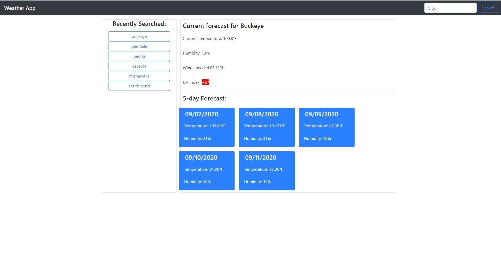

# weather-forecast
A web app which will allow you to search a city, state and report the current forecast and the forecast for the next 5 days.

## Introduction

weather-forecast is a web app utilizing openweathermap.org's public API. Using the free API, you can search for a city and have it return results based on the geographic location. This app will show the current temperature, humidity, wind, and UV index. It will also display the next 5 days as a forecast with the temperature and humidity.

## How-To

Simply type the city name into the search bar and the app will display the data. The recent search menu will show all recent searches as clickable elements which can be recalled from local storage.